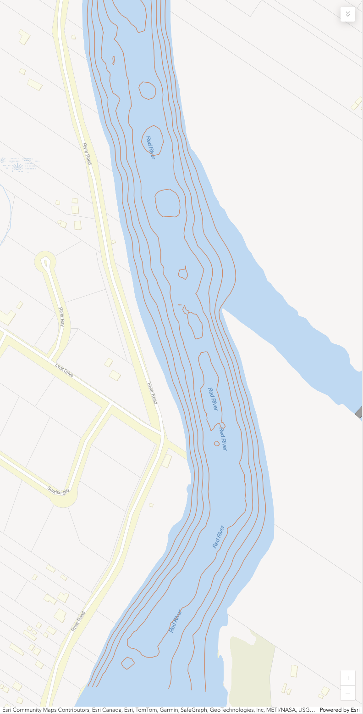

If you've ever spent time on the Red River here in Manitoba, you know one thing for sure: you can't see past the first few inches of water. The mighty Red is famous for its nutrient-rich, chocolate-milk colour, especially downstream of Winnipeg towards Lake Winnipeg.

Because you can't see the bottom, knowing what's happening underneath your boat or off the shore is crucial, whether you're chasing massive channel cats near Lockport or just trying to avoid wrecking your prop.

That's where a map like the one below comes in. This isn't a standard road map; it's a **bathymetric map**. It's specifically designed to show us the underwater topography—the hills and valleys of the riverbed.

Here is a breakdown of how to read this map of the Red River, located just downstream of the St. Andrews Lock and Dam in Lockport.

## 1. The Brown Lines (Contour Lines)

The most critical features on this map are the brown lines swirling through the blue water area. These are called **depth contours** or **isobaths**.

Think of them exactly like a topographical map you'd use for hiking, but in reverse. Instead of showing elevation above sea level, they show depth below the surface. Every point along a single continuous line is the exact same depth.

### Reading the Slope

The spacing between these lines tells you everything about the river bottom's shape:

* **Lines Close Together:** This indicates a **steep drop-off**. If you look closely at the left side of the river in the image (near River Road), you'll see the lines are tightly packed. The depth drops rapidly from the shore to the main channel here.
* **Lines Far Apart:** This indicates a **gentle slope** or a relatively flat bottom. The changes in depth are gradual over a longer distance.

## 2. Finding the "Holes" and Channels

When you're looking at a river system like the Red, the action is usually in the main channel or the deeper pools.

### The Deepest Parts

Look at the center of the river in the image. You will see several small, enclosed circles or irregular loop shapes. These represent the **deepest points** in this stretch of water.

Local anglers often call these "holes." If you imagine draining all the water out of the river, these would be the remaining puddles or bowls in the riverbed.

### The Main Channel

The area where the contour lines are most concentrated and run roughly parallel to the banks marks the main river channel. This is generally where the deepest water is continuous and where the current will be strongest.

## 3. Orientation and Flow

To get your bearings on this specific map:

* **Location:** The streets on the left side—River Road, Lyall Drive, and Sunrise Bay—confirm we are looking at the **west bank** of the river in the St. Andrews area, just north of Winnipeg.
* **Direction of Flow:** The Red River flows North, heading towards Lake Winnipeg. On this map orientation, "downstream" means the water is flowing roughly from the bottom of the image towards the top.

## Why Does This Matter?

Understanding these lines gives you "X-ray vision" into the murky water.

If you are **fishing**, you use this map to find "structure." Fish, like walleye or sauger, love to hang out on the edges of those steep drop-offs (where the lines are close). The big catfish often sit in those deeper holes in the middle to rest out of the heavy current or ambush food floating by.

If you are **boating**, staying between the outermost deep contour lines ensures you are in the safe channel and won't run aground on a shallow mudflat.

